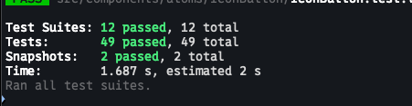

# VotePaws App

Votepaws is a mobile application built with React Native and Expo. Users can browse through a collection of cats, add their favorites, and vote for the ones they like. The app also allows users to upload their own cat photos.

---

### iOS Demo

[▶️ Watch iOS Demo](demo/ios-demo.mov)

### Android Demo

[▶️ Watch Android Demo](demo/android-demo.mov)


### Tech Stack

- **Expo**
- **Expo Router**
- **TypeScript**
- **React Query** (for API requests and caching)
- **React Native Reanimated** (for animations)
- **Jest** 
- **React Native Testing Library**

---

## Bonus Features

This application includes several advanced features that improve scalability, maintainability, and user experience:

### Atomic Design Architecture

- The project follows the **Atomic Design Pattern**, where components are split into Atoms, Molecules, Organisms, etc.
- Logic and UI are separated clearly, making the codebase easier to manage and maintain in the long run.

### Splash Screen & App Icon

- A customized **splash screen** and **app icon** are implemented for both Android and iOS platforms.

### Smart Caching Mechanism

- The app includes a **built-in caching strategy**. For example:
  - If a user views a cat's profile and later revisits it, the cat information loads instantly without needing to fetch the data again.
- This significantly improves performance and reduces unnecessary API calls.

### Home Screen Image Optimization

- On the home screen, cat images are displayed using the **smallest available image sizes** (retrieved from the API) for **faster loading times**.
- However, on the **cat details** page, the app uses **higher-resolution images** to ensure clarity and a better user experience.

### Error Handling

- Errors are handled gracefully and displayed in a **user-friendly** manner, preventing crashes or confusing feedback.

### Performance Optimization

- Data-heavy computations are **memoized using `useMemo`** to avoid unnecessary recalculations, ensuring better performance across the app.

## Testing

This project is fully tested using the following tools:

- **[Jest](https://jestjs.io/)** 
- **[React Native Testing Library](https://callstack.github.io/react-native-testing-library/)** 
- Writing unit tests for all components and screens.
- Mocking native modules and APIs as needed for consistent test results.

To run the test suite:
```bash
npm run test
```



---

## CI/CD with Expo EAS

### Builds & Deployment

- This project supports **CI/CD via Expo Application Services (EAS)** for easier build and release workflows.
- For iOS, the app can be deployed to TestFlight using:

  ```bash
  npx testflight
  ```
- For Android, To build an Android app bundle (AAB)   for production:
  ```bash
  eas build -p android
  ```
  we can automate Android publishing using:
  ```bash
  eas submit -p android
  ```

Ensure that App Store Connect and Play Store & Play Store credentials are properly set up beforehand.

### Secure Environment Variables
- Sensitive configuration (ex: API keys) are stored securely using EAS environment variables.

- These variables are accessed via app.config.ts and used through expo-constants in the app.

- This prevents hardcoding secrets and helps avoid reverse-engineering risks.

### Core Features & Implementations

The app includes the following core features:

1. Users can **upload new cat images** directly from their device.
2. Users can **view all cat images they have uploaded**.
3. Users can **favourite or unfavourite** any cat.
4. Users can **vote cats up or down**.
5. Each cat displays a **score based on the total votes** it has received.
6. Users can **view a cat's profile and read detailed information** about it.

### Implementation Highlights

- ✅ The app has a **clean, modern UI** that works well across various screen sizes, ensuring a smooth experience for non-technical users.
- ✅ Built using **React Native and Expo**, aligned with the requirements of the role.
- ✅ Implements features expected from a modern app, including:
  - Proper **error handling**
  - **Caching** for performance optimization
  - **Responsive layouts** for different screen sizes

---

### How to Run

#### 1. Install Dependencies

Ensure **Node.js** is installed, then run:

```bash
npm install --legacy-peer-deps
```

### 2. Configure Environment Variables
Create a .env file at the root of your project with the following:

```bash
EXPO_PUBLIC_BASE_URL=https://api.thecatapi.com/v1
CAT_API_KEY=live_JWVg41i2rNdMKfkpeGJxb3aR5qlPWOBGQALlzzHnXWx0CoKT14wCnaYSpk174RMJ
```

3. Run the App
To start on iOS:

```
npm run ios
```

To start on Android:
```
npm run android
```

### Created by Pasquale Palena